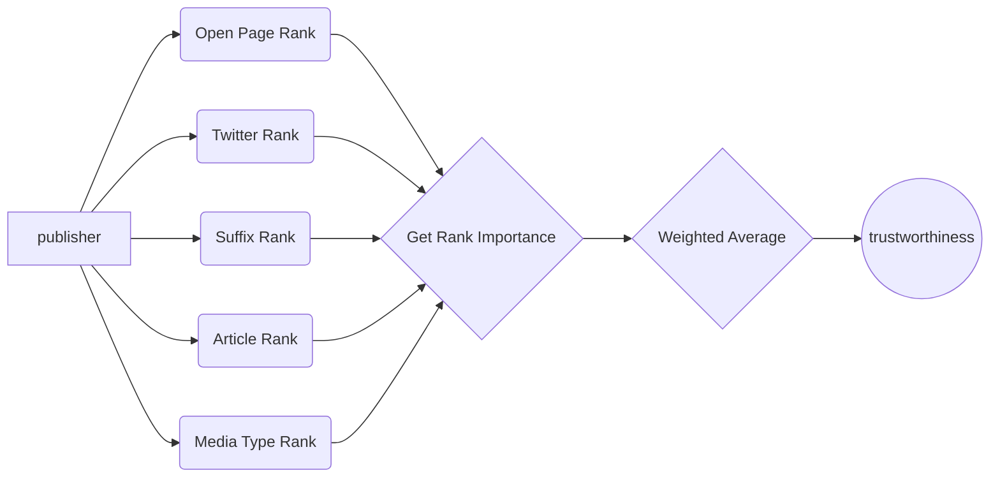
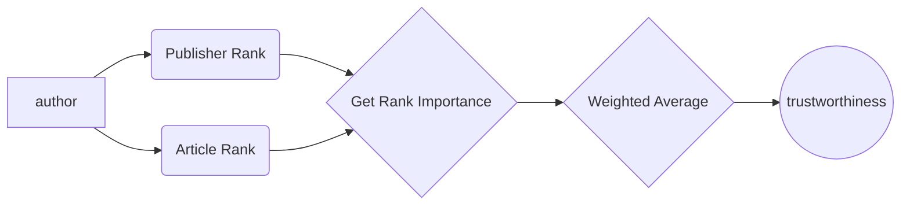

# Source Credibility Analysis

The scope of this document is define the different procedures and methodologies that are using throughout FANDANGO in order to measure the credibility of a certain source. Firstly, when we talk about a **source**, we are referring to a Publisher or a certain author that is spreding news or any othe multimedia content throught the Internet.


## Technology involved in the Analysis

The following frameworks are employed to assess the analysis:

 1.  **Elasticsearch** which is a powerful search engine that is employed to stored the information of the different sources to be retrieved, processed or updated.
 2. **Neo4j** which is a potential Graph Framework and contains different features that might be used when analysing relationships among the different elements of the analysis.
 3. **Open Page Rank API**  [Here you can find the documentation](https://www.domcop.com/openpagerank/documentation)

 4. **Twitter API** [Here can find the documentation](https://developer.twitter.com/en/docs/api-reference-index)

## Source Credibility Scores
The scope of this section consists in describing the different scores that are computed using the aforementioned frameworks. All the scores are normalized between **(0, 100)** in order to standarize the metrics. Once all the metrics are computed, a weighted average is computed to measure the level of credibility.

### Open Page Rank 

Using the Open Page Rank API, we are capable of measuring the importance of the source on the Internet Network. The algorithm for this purpose is based on the so-called Google Page Rank Algorithm as well as the Alexa Rank algorithm. 

Basically, the higher the rank is, the higher the importance of the source on the Internet. Therefore, the range of the algorithm is (0, +inf). 

As we said before, we need this value to be in the range (0, 100), so that, we need a mapping function to our purpose. 

\begin{equation}

\alpha = 100\hspace{0.05cm} \mathit{S} \left( log(2) * log(\Omega) \right)
\end{equation}


Where *S* denotes the sigmoid function, $`\Omega`$ indicates the **Open Page Rank metric** and finally $`\alpha`$ refers to the **normalized page rank metric** that will be fused in the final stage.


### Twitter Rank
The use of Twitter in this analysis lies in the importance of Social networks when spreading potential fake news. More specifically we are trying to measure the following information from a certain Twitter user account:

 1. Level of **Activity** 
 2. Level of **Popularity**
 3. A **Verification** Score

The **level of activity** is measured by infering the **average of the number of tweets posted per day**. Subsequently, the level of **social popularity** is measured using the following equation:


where *followers* refers to the number of followers whereas *friends* refers to the amount of friends of the account.

Finally, the **verification score** is computed by analysing whether the account has the **location** and the **verification parameter** available. Therefore, if the account has both location and verification available, the score will be higher. On the other hand, if it has not available such information, the verification score will be much lower.
 
 #### Twitter overall metric
 Finally, after computing the aforementioned metrics, a fuzzy function is computed to map all the cases into a function between 0 and 100.
**The interpretation** of this metric is the following: **the higher the metric, the higher the probability of the Twitter account to be legitible is**.
 
### Suffix Analysis
The next metric considers the suffix of the domain since many domains are well known such as the .edu (Academic), .org(Organizations) or .gov (Goverment). On the other hand, there exist other well-known suffix such as the commercial one (.com), the network domain (.net) as well as all the countries domains. 

Therefore this metric is a straighforward calculation where each specific suffix has a **deterministic score** (i.e Academic or Goverement Suffix will have a much higher score than a .com suffix). More specifically, the weights are extracted from a Gaussian distribution $`G(\mu =0, \sigma =1)`$ where for instance the Goverment or the Academic sufixes will have a weight corresponding to the highest probability of the distribution $`(x=0)`$ and so on.

### Article Rank
As expected, we are also analysing the content of the document in order to verify its level of trustworthiness based on Natural Language Processing (NLP) techniques. 

Consequently, we incorporate a feature based on the result of the Deep Learning models that are used to infer the stylographic analysis of the text. The process can be separated in the following steps:

 1. Retrieve all the articles associated to the source.
 2. Extract the Text Ratings based on the Stylographic of the content.
 3. Measure the relevance of the ratings considering a relevance function to normalize the ratings.
 4. Perform a median of the normalized ratings.

The relevance function $`r(x;\mu)`$ is used to measure how important the results are based on how many documents a certain source has. The following function is used for this purpose:

```math
r(x; \mu) = 1 - \left( \frac{1}{(1+\mu x)}\right)
```

where $`\mu=0.20`$ and is defined as a controlled parameter, whereas $`x`$ represents the number of documents associated to the source. 

Therefore, each independent text rating $`t_r`$ is "normalized" using the following expression:

```math
\bar{t}_r = 100(t_r) r(x; \mu=0.20)
```

where $`\bar{t}_r`$ indicates the normalized text rating. Finally, all these normalized ratings are averaged by taking the median.


### Media Type Rank

Finally, the last metric is very similar to the suffix measurement but in this case, we are trying to give a weight regarding the type of media (i.e Press Agency, Newspaper, Magazine, Blog etc.).

To do so, we first created a potential Database by Crawling [Media List](http://www.abyznewslinks.com/allco.htm) for many countries including Spain, Italy, Greece, Belgium, France, Netherlands, Germany, UK, USA and Russia. 

Then, we established a weight for the following media type in the following order:

 1. Broadcast
 2. Press Agency
 3. Newspaper
 4. Magazine
 5. Other media type

More specifically, the weights are extracted from a Gaussian distribution $`G(\mu =0, \sigma =1)`$ where the Broadcast or the Press Agency will have a weight corresponding to the highest probability of the distribution $`(x=0)`$ and so on.


## Overall Score

The final overall score is computed by taking a weighted average of the aforementioned features together with the importance of each of them. To select the order of the importance of the features, the following criteria is employed:

 1. Article Rank
 2. Twitter Rank
 3. Open Page Rank
 4. Media Type Rank
 5. Suffix Rank

As expected, the weights must be normalized between 0 and 1 and must sum up 1. To do so, we again employed a Gaussian distribution for obtaining the weights in the aforementioned specific order.


Similar diagram showing the extraction of the trustworthiness regarding the authors involved in the writing of the document:


